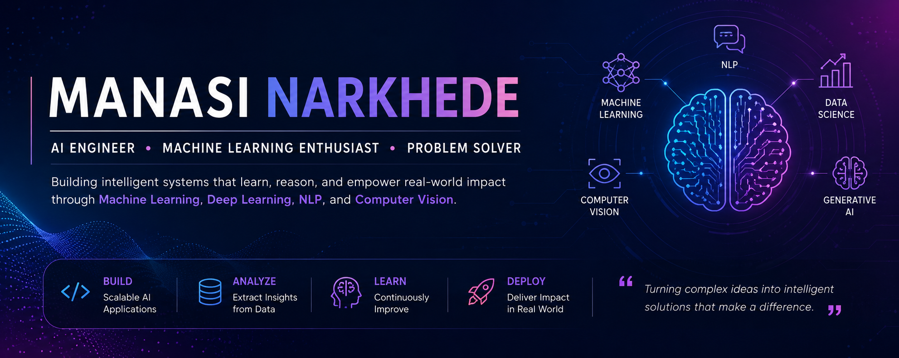

<p align="center">
  
</p>

<h1 align="center">Hi, I'm Manasi Narkhede 👋</h1>

<h3 align="center">
AI Engineer | Machine Learning Enthusiast | Building Intelligent Systems
</h3>

<p align="center">
Building AI-powered solutions that transform data into meaningful impact.
</p>

---

## 🚀 About Me

- 🔭 Currently working on Multimodal Deep Learning and AI-powered prediction systems
- 🤝 Open to collaborating on Machine Learning, NLP, Computer Vision, Generative AI, and Open Source projects
- 🌱 Currently exploring Multimodal AI, Reinforcement Learning, and LLM Applications
- 💬 Ask me about Python, Machine Learning, Deep Learning, RAG Systems, PyTorch, FastAPI, and AI Development
- ⚡ Fun fact: I enjoy turning complex research ideas into practical AI solutions that people can actually use

---

## 🛠️ Tech Stack

### Languages


### Machine Learning & AI


### Data Science & Analytics


### Backend & Tools


### Databases


---

## 💡 Skills Snapshot

```text
Machine Learning      ██████████
Deep Learning         █████████░
NLP                   █████████░
Computer Vision       ████████░░
Generative AI         ████████░░
RAG Applications      █████████░
Reinforcement Learning ██████░░░░
```

---

## 🚀 Featured Projects

### 🎓 Multimodal Academic Performance Prediction
A deep learning framework that combines text, tabular, and behavioral data to predict student academic performance using multimodal learning techniques.

### 🤖 RAG Python Glossary QA Bot
Built a Retrieval-Augmented Generation chatbot that answers Python-related queries using semantic search, vector embeddings, and LLMs.

### 🎙️ Automated Podcast Transcription & Topic Segmentation
Developed an NLP pipeline that transcribes long-form podcasts, extracts entities, and automatically segments content into topics.

---

## 🎯 Areas of Interest

- Machine Learning
- Deep Learning
- Generative AI
- Large Language Models (LLMs)
- Natural Language Processing
- Computer Vision
- Retrieval-Augmented Generation (RAG)
- Multimodal AI
- Reinforcement Learning
- AI Research

---

## 📊 GitHub Stats

<p align="center">
  
  
</p>

<p align="center">
  
</p>

---

<p align="center">
  
</p>

<p align="center">
  <i>"Building intelligent systems that bridge research and real-world impact."</i>
</p>
